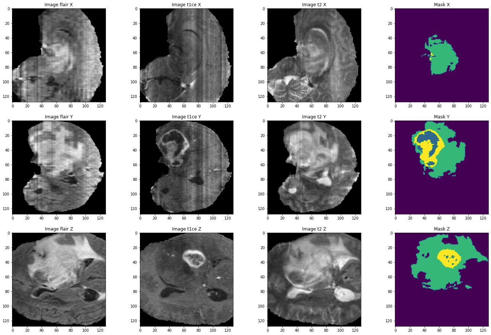
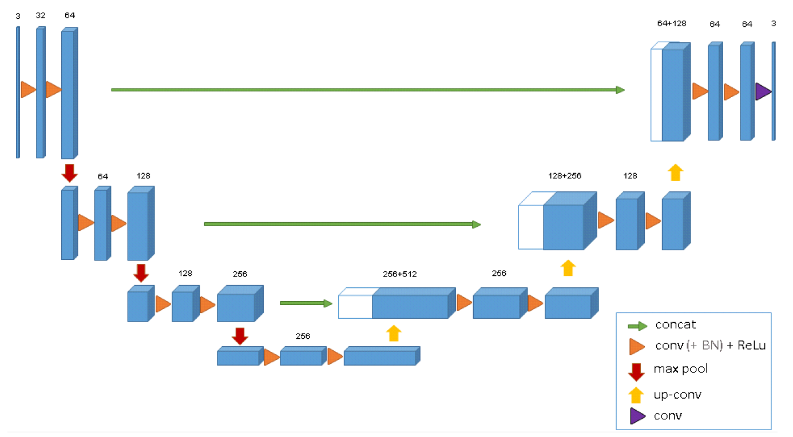

# Brain Tumor Segmentation
[](https://www.python.org/)
[](https://github.com/sdsubhajitdas)

"Brain Tumor Segmentation of MRI Images using 3D U-Net model architechture"

## Description

This project aims to segment brain tumors in MRI images using machine learning algorithms. Brain tumors can be difficult to detect and diagnose, but accurate segmentation of these tumors can help clinicians better understand the extent and location of the tumor, and guide treatment decisions. We are using a deep learning approach to train a model that can accurately segment brain tumors in MRI images.

<!-- Use google colab for further training and prediction.  -->

## Overview
- [Dataset Used](#dataset)
- [Model Architecture](#model-architecture)
- [Training Process](#training-process)
- [Results](#results)

## Dataset

We used the [Brats2020](https://www.kaggle.com/awsaf49/brats20-dataset-training-validation) (Brain Tumor Segmentation) dataset, which consists of MRI images of brain tumors along with ground truth segmentations. The dataset contains 369 cases, each with four MRI modalities (T1, T1-contrast, T2, FLAIR) and a ground truth segmentation.

* Each volume have 4 segmentation labels:

```
Label 0: background
Label 1: necrotic and non-enhancing tumor
Label 2: edema 
Label 4: enhancing tumor
```
We preprocessed the data by normalizing the pixel values and resizing the images to a fixed resolution of 128x128x128 pixels.



## Model Architecture
This project's model is based on [U-Net Architecture](https://arxiv.org/abs/1505.04597) to create segmentation masks for brain tumor images. The U-Net architecture consists of an encoder and a decoder, with skip connections between the two. We also used batch normalization and dropout to improve the performance of our model.

The model architecture is depicted in this picture.

We used modified version of the original U-Net as in 3D U-Net architecture, which performs better in 3d Brain segmentation tasks. 


## Training Process

We trained our model using the Adam optimizer with a learning rate of 0.001. We used a batch size of 16 and trained the model for 50 epochs. To prevent overfitting, we employed data augmentation techniques such as random rotations, flips, and shifts.

Used the 3D-Unet Model to train the Model with Loss function(dice_loss and folcal-loss), for Optimizer used Adam and for metrics used IoU score (greater than 0.5 is good for segmentaion).


## Results

Our model achieved an accuracy of 0.97, a precision of 0.92, a recall of 0.95, and an F1 score of 0.92. 

<!-- We also visualized the segmentation results using color-coded overlays on the original MRI images. -->

The average IoU score achieved during training process is 0.53 and validation process is 0.49.

<!-- ## How to Use

To use our model to perform brain tumor segmentation on new MRI images, first install the required dependencies listed in the "requirements.txt" file. Then, run the "predict.py" script with the path to the input MRI image as an argument. The script will output a segmented image in the "results" folder. -->


<!-- ### Training Process
The model was trained on a [Nvidia GTX 1050Ti](https://www.geforce.com/hardware/desktop-gpus/geforce-gtx-1050-ti/specifications) 4GB GPU. Total time taken for model training was 6 hours and 45 minutes. We started with an initial learning rate of 1e-3 and reduced it by 85% on plateauing, final learning rate at the end of 100 epochs was 2.7249e-4.<br>
Some graphs indicating Learning Rate & Loss Value over 100 epochs are given below.


To see the complete output produced during the training process check [this](logs/05-47-51_PM_on_May_20,_2019/training_output_log.txt) -->

<!-- ## Installation
This project uses python3.

Clone the project.
```bash
git clone https://github.com/Jeetu95/Brain-Tumor-Segmentation.git
```
Install Pytorch from this [link](https://pytorch.org/get-started/locally/)<br>
Use pip to install all the dependencies
```bash
pip install -r requirements.txt
```
To open the notebook
```bash
jupyter lab
```

To setup the project dataset
```bash
python setup_scripts/download_dataset.py
python setup_scripts/unzip_dataset.py
python setup_scripts/extract_images.py
``` -->


<!-- ## Results
The mean [Dice Score](https://en.wikipedia.org/wiki/S%C3%B8rensen%E2%80%93Dice_coefficient) our model gained was 0.74461 in testing dataset of 600 images.<br>
From this we can conclude that in our testing dataset our constructed mask has a similarity of about 74% with the original mask.<br>
Some samples from our training dataset output are below. The top best results are [here](images).To see all the results click on this [Google Drive link](https://drive.google.com/drive/folders/1vwwUipaH9Yb0NLelv3lW-04E6WnVJ3nh?usp=sharing)<br>
 -->
<!-- 
## License
[MIT License](LICENSE) -->